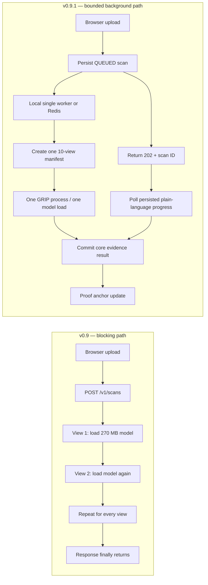

# CreatorProof v0.9.1 — scan-stall correction report

Date: 2026-08-09  
Build: `BATCHED-NONBLOCKING-SCAN-2026.08.09`

## Bottom line

The v0.9 stall was architectural, not a threshold problem. A heavy external detector was started once
per transformed view and the scan ran inside the upload request. v0.9.1 removes both multipliers:

1. every view is passed to GRIP through one manifest and one upstream CSV run;
2. local scans execute on a background worker and `POST /v1/scans` returns the scan ID immediately;
3. persisted progress is polled through `GET /v1/scans/{scan_id}`;
4. external-detector and OCR deadlines apply to the whole provider stage, not each view;
5. proof anchoring starts only after the core result is committed.

No match, style, AI-origin, calibration, or policy threshold was changed in this latency correction.

## Before and after



## Why the old runtime exploded

Let:

- `N` = number of views;
- `L` = model/process cold-start time;
- `Iᵢ` = inference time for view `i`;
- `T` = timeout assigned to one invocation.

The old expected external-stage cost was approximately:

`C_old = Σᵢ(L + Iᵢ) = N·L + ΣᵢIᵢ`

With the reported `N = 10` and `L ≈ 10.5 s`, cold starts alone cost roughly `105 s`. The old
worst-case timeout envelope was `N·T`; a 180-second timeout could therefore expose 30 minutes for
one detector before accounting for OCR, provenance, retrieval, style, proof, or multiple detectors.

The batched path is:

`C_new = L + I_batch(1…N)`

and its external process receives one capped whole-stage timeout. The actual `I_batch` must be
measured on the target CPU/GPU; it is not manufactured in this source-only report.

## Implemented corrections

| Area | v0.9 failure | v0.9.1 correction |
|---|---|---|
| GRIP adapter | one image per upstream run | `--manifest` writes one multi-row CSV and parses one result per stable ID |
| External provider | one subprocess and fresh timeout per view | one manifest subprocess; legacy image commands share one decreasing deadline |
| Local jobs | `inline` callback blocked the request | one-worker `LocalThreadJobQueue`; stale development `inline` config migrates safely |
| Deployment jobs | simple queue path retained | Redis API/worker separation remains the durable deployment route |
| Progress | seven-second finite poll looked like a frozen spinner | progress persisted in the scan row with plain labels and percentages |
| Browser | endless-looking `Verifying…` | 180-second live polling window, clear elapsed time, scan ID, and recoverable **Check again** |
| BFF proxy | upstream request could hang | 30-second scan-accept timeout and 8-second progress-poll timeout |
| OCR | timeout multiplied by PSM mode and crop | one 12-second default budget across all OCR work |
| Proof | slow EAS receipt delayed the analysis | core result commits first; proof updates independently and cannot fail the scan |
| Duplicate work | duplicate queue delivery could process twice | atomic `QUEUED → PROCESSING` claim; only one worker owns a scan |

## Runtime contracts

### Local demo

- `CREATORPROOF_JOB_BACKEND=local`
- `CREATORPROOF_LOCAL_JOB_WORKERS=1`
- non-durable across API restarts;
- deliberately one worker to avoid CPU/GPU oversubscription and model contention.

### Docker or paid pilot

- `CREATORPROOF_JOB_BACKEND=redis`
- API enqueues only `scan_id`;
- worker reads canonical state and evidence from PostgreSQL/object storage;
- Redis is transport, not the system of record.

### External detector

The GRIP entry in `.env` must contain `{manifest}`:

```text
python -m scripts.clipdet_json_adapter --manifest {manifest} ...
```

`{image}` remains compatible for other research adapters but cannot receive more than one configured
whole-detector budget across all views.

## Progress states

The normal scan response remains canonical. While a scan is running, `evidence_packet` temporarily
contains `creatorproof.scan_progress.v1` with these user-facing stages:

1. Starting the evidence checks
2. Preparing the image
3. Checking source information
4. Looking for visible AI labels
5. Checking AI-use signals
6. Searching registered works
7. Checking the creator profile
8. Comparing the closest registered works
9. Creating the evidence receipt

The completed Evidence Packet replaces the temporary progress object.

## Verification added

- batch manifest returns ten view scores from one `subprocess.run`;
- batch IDs and output filenames must match exactly;
- legacy commands receive a monotonically decreasing shared deadline;
- local queue enqueue returns before its callback finishes;
- live `POST /v1/scans` returns `202` while a deliberately blocked background callback is unfinished;
- scan claiming is conditional on the canonical `QUEUED` state;
- all existing detection and policy regression tests remain in the suite.

Run the real timing harness after model activation:

```bash
cd apps/api
uv run python -m scripts.benchmark_scan_latency /absolute/path/to/image.png \
  --api-url http://localhost:8000 \
  --api-key change-me-before-sharing \
  --catalog-id demo-catalog
```

It reports request acceptance, background runtime, stage transitions, provider inference modes, and
the synthetic-lane timings recorded in the final packet.

## Acceptance gates for the next execution report

1. API and web both report `0.9.1` and the exact build signature.
2. Health reports `job_backend: local-thread` locally or `redis` in Compose—never `inline` outside tests.
3. `POST /v1/scans` returns a scan ID in under 5 seconds for a normal local image upload.
4. The scan is initially `QUEUED` or `PROCESSING`, and at least one persisted progress stage is observed.
5. A configured GRIP member reports `inference_mode: BATCHED_VIEWS` and `view_count: 10` when spatial crops are enabled.
6. One scan causes one GRIP adapter process, not one process per view.
7. The scan reaches `COMPLETED` or a typed `FAILED` state; the UI never waits forever.
8. The benchmark is run at least three times after one warm-up, reporting median and worst-case time.
9. Match/style/origin outputs are compared with v0.9 fixtures to confirm this runtime patch did not alter decision semantics.
10. No model-accuracy claim is made from latency tests or toy images.

## Honest remaining limitations

- Batched GRIP still cold-starts once per scan. A production service should move the licensed upstream
  model into a supervised, long-lived inference process after its Python API and memory behavior are
  validated. That is the next scale step, not a prerequisite for the ideathon demo.
- The local thread backend loses queued work if the API process exits. Use the Redis worker for durable work.
- A provider timeout bounds waiting; it does not make a slow model accurate or fast.
- Multiple configured external detectors each retain an independent capped budget.
- Real latency depends on model files, runner environment, CPU/GPU, image dimensions, and catalog size.
- This correction improves runtime behavior only. It does not establish universal AI-image detection.

## Primary technical sources

- Official GRIP repository: its CLI consumes a CSV list of images, which makes one multi-image run the
  correct upstream-compatible integration: <https://github.com/grip-unina/ClipBased-SyntheticImageDetection>
- FastAPI background-task guidance says heavy computation should use a worker/queue architecture rather
  than hold the request process: <https://fastapi.tiangolo.com/tutorial/background-tasks/>
- Redis job-queue guidance documents API/worker decoupling and reliable claim/retry patterns:
  <https://redis.io/docs/latest/develop/use-cases/job-queue/>
- Python documents that `subprocess.run(..., timeout=...)` applies to that invocation; repeating it
  repeats the timeout envelope: <https://docs.python.org/3/library/subprocess.html>
- PyTorch warns that multiprocessing CPU oversubscription can create severe contention, supporting a
  single local model worker by default: <https://docs.pytorch.org/docs/stable/notes/multiprocessing.html>

