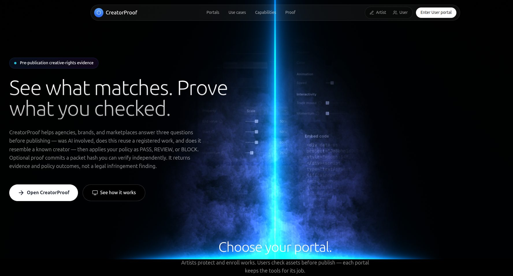
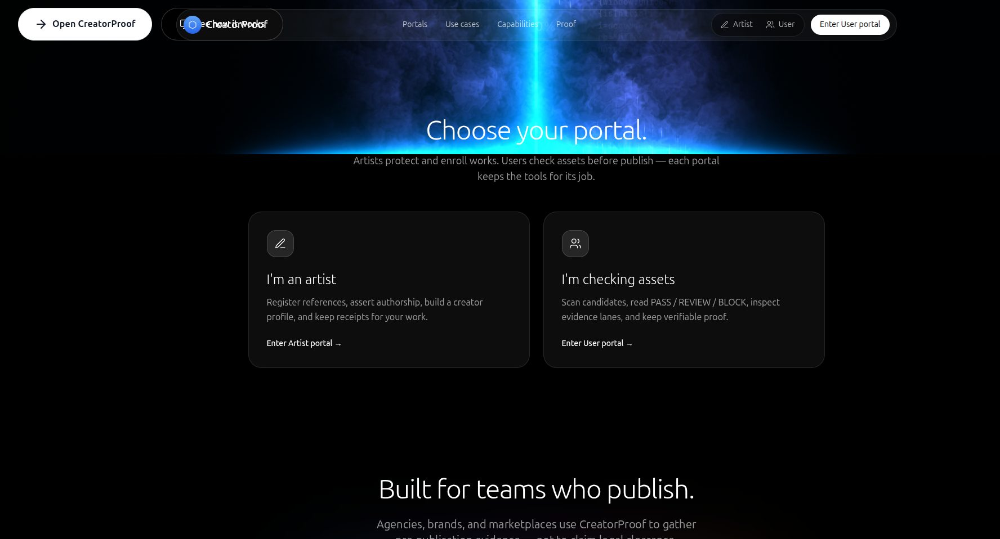
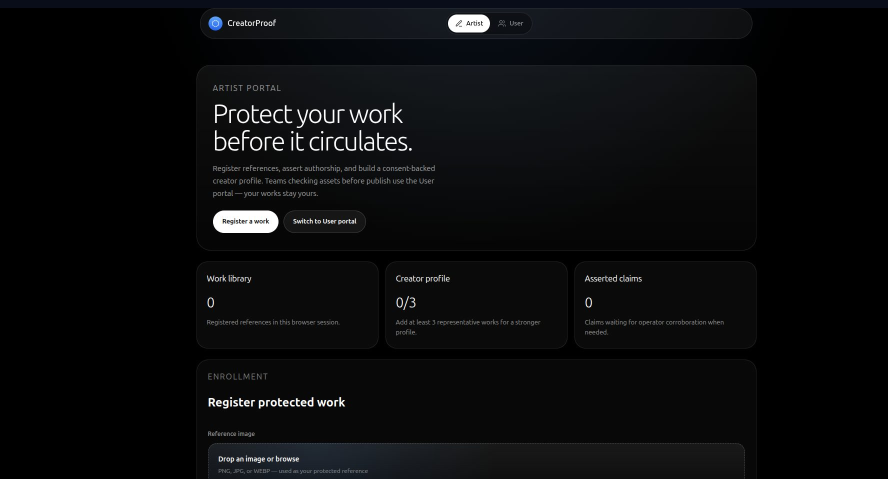
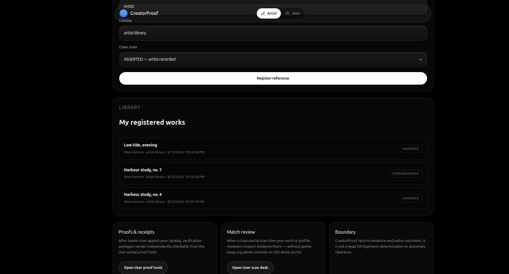
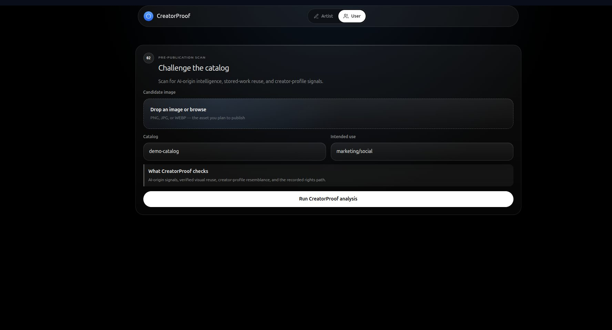
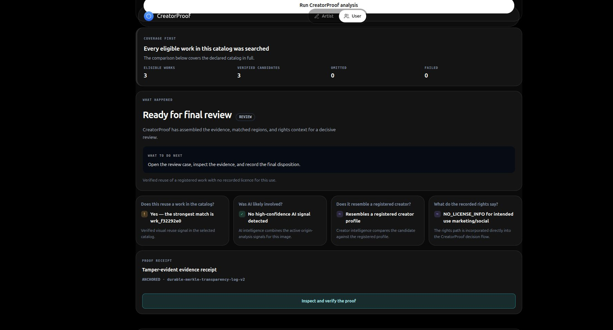
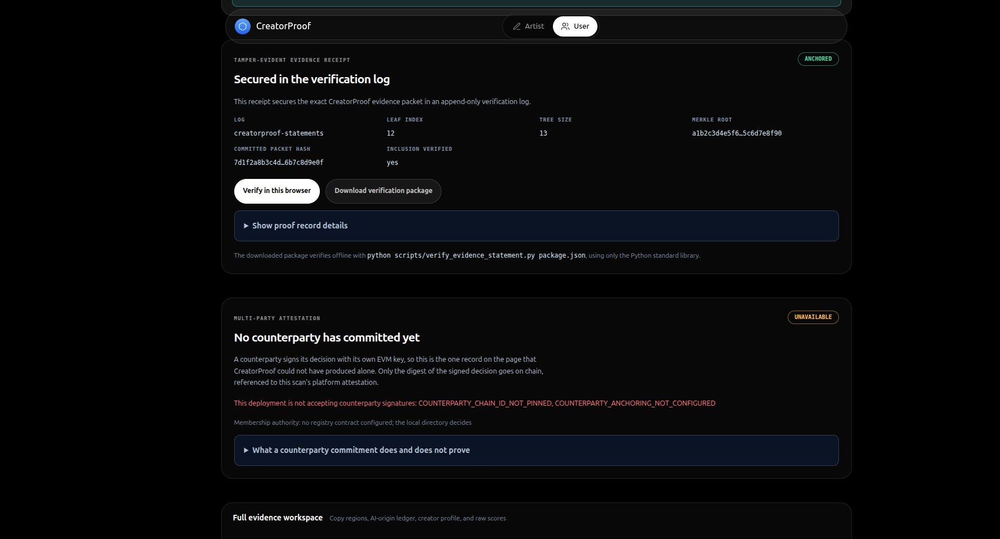
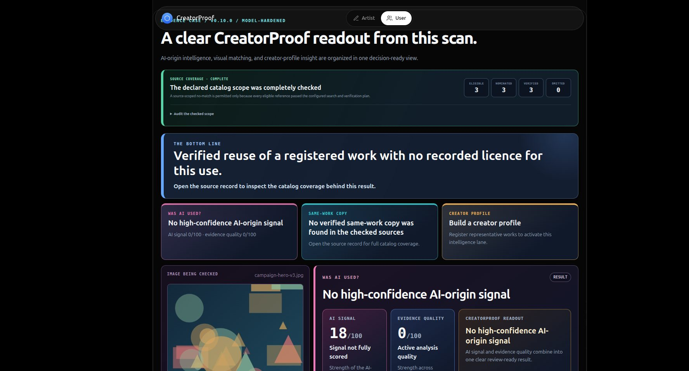
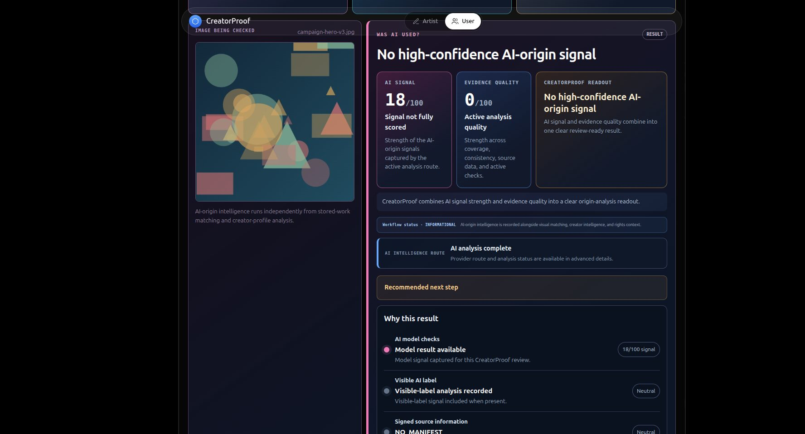

# Artist and User portal design overhaul

A design audit of the two portals against the marketing homepage, an argument about
what these two surfaces should be, and a sequenced implementation plan.

Everything in the audit was measured in a running browser against
`http://localhost:3000` on 2026-08-12, or counted directly out of
`apps/web/app/globals.css`. Numbers are cited so they can be re-checked.

---

## 0. What has shipped so far

Sections 1–6 are the original audit and plan, kept as written. This section
records what is actually in the tree, so the two do not drift apart.

**Foundation.** Four variable fonts are self-hosted from `public/fonts/` and the
Google Fonts CDN links are gone, so the homepage now renders completely offline.
`app/styles/tokens.css` holds the colour, type, spacing and radius ramps that both
portals read.

**One source of truth for lane verdicts.** `app/lib/laneStatus.ts` derives every
lane's question, headline, answer and state in one place; `BottomLine` and
`EvidenceMicroscope` both read it. This closed the contradiction where the summary
and the microscope disagreed about the same scan. It carries 14 unit tests
(`node --test --experimental-strip-types app/lib/*.test.ts`).

**Demo scenarios are wired.** `DemoScenarioPicker` exposes the four prepared
scenarios that `demoScenarios.ts` had been generating for nobody. Each one builds
its references and candidate in the browser and runs a real scan.

**The homepage pipeline section** replaced three fabricated customer testimonials
with the product's actual four stages, in the homepage's own frosted-glass idiom.

**Colour.** See the amendment below.

**The enrollment AI-origin gate.** `POST /v1/works` now screens every submitted
file before any database write and refuses one the origin lane positively
identifies as AI-generated. Behaviour is set by
`CREATORPROOF_REGISTRATION_ORIGIN_GATE` (`BLOCK`, the default; `FLAG_ONLY`; `OFF`).
The design rule is that only a positive finding refuses: an unknown, unavailable
or inconclusive result always admits the file, because locking an artist out of
their own catalog over a missing detector is a far worse failure than admitting a
file that should have been caught. A screening crash admits the file too. Covered
by `tests/test_registration_origin_gate.py`.

### An amendment to the colour rule

Section 6 asked that "colour appears only where it means PASS, REVIEW, BLOCK, or a
claim state". That rule produced two portals that were, correctly, unreadable as
*different places* — a reviewer arriving mid-demo could not tell which one was on
screen. The rule is therefore widened to three named jobs, and no fourth:

1. **Outcome** — PASS, REVIEW, BLOCK, and the four claim states.
2. **Evidence lane** — copy is cyan, AI-origin is pink, creator-profile is amber.
   The same three hues identify the same three lanes on the homepage flowchart,
   in the scenario picker, and in the results.
3. **Portal identity** — the Artist portal is violet, the User portal is cyan,
   set once as `--portal-accent` on `.portalPage.isArtist` / `.isUser` and
   inherited by the hero, kickers, stat figures, card strokes and focus rings.

Colour still never decorates. Nothing is coloured to look interesting, and no
element takes a hue that does not answer "which outcome", "which lane", or "which
portal".

---

## 1. The homepage sets a standard the portals do not meet

The homepage is not a Next.js page. `proxy.ts` rewrites `/` to the static
`public/landing.html` (123 KB), which carries its own Tailwind-CDN styling. The
portals at `/artist` and `/user` are React pages styled by a separate 1,947-line
hand-written `globals.css`. Nothing is shared between them — not a token, not a
font, not a container width.

Measured side by side:

| | Homepage (`/`) | Portals (`/artist`, `/user`) |
|---|---|---|
| Page background | `#000000` | `#080d19` plus cyan and purple radial washes |
| Content width | 1280 px | 1120 px |
| Body typeface | `SF Pro Text` | `Inter` |
| H1 | 72 px / weight 300 / −1.8 px | 52 px / weight 300 / −2.08 px |
| H2 | 48 px / weight 300 / −1.2 px | no equivalent step |
| Card fill | `rgba(255,255,255,.05)` | `rgba(255,255,255,.04)` |
| Card border | `1px rgba(255,255,255,.10)` | `1px rgba(255,255,255,.10)` |
| Card radius | 24 px | 22 px |
| Card padding | 32 px | 20 px |
| Primary button | pill, white, 16 px / 700, `14px 28px` | pill, white, **13 px**, full-bleed width |

The card treatment is close enough that someone clearly tried to align it. The
things that actually decide whether two pages feel like one product — the
background colour, the typeface, the measure, the type scale, the button scale —
were never brought across. Walking from `/` to `/artist` reads as walking from a
finished product into its admin console.

### The homepage's visual grammar, for reference





Worth naming explicitly, because the overhaul should inherit it rather than
invent something new:

- Pure black canvas with atmospheric light — a vertical beam behind the hero,
  soft blue bloom at section edges. Depth comes from light, not from grey boxes.
- A floating pill navigation bar, `fixed inset-x-4 top-4`, 56 px tall.
- Full-pill buttons: white fill with near-black text for primary, transparent
  with a 20 %-white hairline for secondary.
- Icons in rounded-square chips at the top-left of cards.
- Uppercase, letter-spaced, colour-tinted eyebrow labels above headings.
- Statistic pills: a coloured dot, a monospace numeral, a short label.
- Restrained accent range: blue `#3b82f6`, sky `#38bdf8`, indigo `#a5b4fc`, and a
  `135deg` blue→indigo→white gradient for emphasised words.
- Generous vertical rhythm; large light-weight headings; short measure on body copy.

### Three problems the homepage itself has

These matter because "coherent with the homepage" is only a good goal if the
homepage is sound.

1. **It cannot survive a bad network.** The page pulls 24 external resources,
   including `cdn.tailwindcss.com` (the browser JIT build, explicitly not for
   production), `unpkg.com/lucide@latest` (unpinned, so it can change under you),
   GSAP, and UnicornStudio. On venue Wi-Fi that blocks or throttles a CDN, the
   first thing a judge sees degrades to unstyled HTML.
2. **The typeface never arrives.** The page links eight Google Font families
   (Geist, Roboto, Montserrat, Poppins, Playfair Display, Instrument Serif,
   Merriweather, Bricolage Grotesque) and uses none of them; the CSS asks for
   `SF Pro Display` / `SF Pro Text`, which is not loaded and does not exist
   outside Apple hardware. A canvas probe confirms `SF Pro Display`, `SF Pro Text`
   and `Inter` all resolve to the same fallback on this machine. The identity you
   designed is only visible on a Mac.
3. **Placeholder copy is still in the footer.** "Cloud IDE / Deployment /
   Analytics / Monitoring", "The development platform that empowers teams to
   create extraordinary digital experiences", "© 2024". This is page-builder
   boilerplate on a page whose whole argument is rigour.

---

## 2. What the portals look like today

### 2.1 Artist portal



The hero is a flat bordered rectangle. Its right 45 % is empty. There is no
image anywhere on the page — on a portal whose entire purpose is registering
artwork.

Below it, three statistic cards (`0`, `0/3`, `0`) with no icon, no colour, no
trend, no next action.

**The registration form.** A single column of inputs, each measured at
**1,072 px wide**, for values like "Title" and "Catalog". The submit button is
**1,074 px** wide with 13 px text. Field labels are 12 px at 58 % white. A
1,072 px input for a short string is not a layout choice, it is the absence of
one; the eye has to travel the full width of the card to confirm a six-character
value.

The file field (`PortalFileField.tsx`) renders only the filename. No thumbnail,
no dimensions, no preview — for the image that is about to become the artist's
legal reference.



**The library, populated with three works.** Still no thumbnails. Each row is a
title, a run-on metadata string (`Mara Iversen · artist-library · 8/12/2026,
10:56:56 PM`) in small low-contrast type, and a status pill. `ASSERTED` and
`CORROBORATED` — states with genuinely different legal weight — render in
identical neutral grey. There are no per-row actions: you cannot open a work,
check its proof, or remove it.

Two further issues in `artist/page.tsx`: the library lives only in
`localStorage`, so it is a per-browser illusion rather than the server's record;
and the empty state is a single grey sentence in a large empty card.

### 2.2 User portal



`user/page.tsx` is 19 lines: nav, then `UserScanDesk`. **There is no hero at
all**, while `/artist` has one. Two-thirds of the first viewport is empty black.
The card carries a `02` step badge with no `01` anywhere. Nothing states what
the portal does, what PASS / REVIEW / BLOCK mean, or what happens after you press
the button.

**During a scan**, the progress panel appeared reading "Scan still running" and
"Live updates paused after three minutes. Your scan was not cancelled." while the
stage ledger beside it read `17s elapsed`. The primary button simultaneously
returned to its enabled "Run CreatorProof analysis" state. A real scan then sat
at 66 %, "Checking the creator profile", with no further feedback. This is
precisely the moment a live demo is won or lost, and the screen contradicts
itself.

**The results view** measures **≈ 8,100 px — about 12.8 screens of scrolling.**



The verdict is the product. `REVIEW` renders as a small grey pill beside a
17 px heading, in a card that looks exactly like every other card. Coverage,
decision, four lane cards and the proof strip all share one flat grey treatment,
so nothing is loudest. The copy lane reports "Yes — the strongest match is
`wrk_f32292e0`" — a raw database identifier shown to a reviewer, even though the
packet carries the work's title and claimant.



The proof panel is the best-composed part of the app: a real label/value grid, a
green `ANCHORED` state pill, two clearly ranked buttons. It is still let down by
9-11 px labels and a full-width navy bar for what is only a disclosure toggle.



**`EvidenceMicroscope` is a third design system on the same page.** Saturated
pink, teal, amber and purple borders; left colour bars; gradient panels; cards
nested three deep; type noticeably larger and bolder than the portal chrome
above it. Nothing about it looks like the two systems it sits between.

It also **duplicates and contradicts** the summary directly above it. `BottomLine`
says "Yes — the strongest match is `wrk_f32292e0`"; the microscope says "No
verified same-work copy was found in the checked sources". Both are on screen at
once. For a product whose pitch is evidentiary rigour, two contradictory answers
to the same question is the most expensive bug on this page.



Further down: a tall narrow image column with a large dead area beneath it, an
empty "Recommended next step" card, and raw reason codes
(`SINGLE_EVIDENCE_FAMILY · SCORE_BELOW_REVIEW_THRESHOLD`,
`COUNTERPARTY_CHAIN_ID_NOT_PINNED`) presented to end users as body copy.

### 2.3 What the stylesheet says

`globals.css` is a single flat 1,947-line file with **224 class selectors**, and
it has no system underneath it:

| Measure | Count | Consequence |
|---|---|---|
| CSS custom properties declared | **18** | The token layer covers almost nothing |
| Hard-coded hex colours | **322** | Colour cannot be changed centrally |
| `rgba()` literals | **292** | Same |
| Distinct `font-size` values | **16** (7 px → 30 px) | No type scale |
| Distinct `border-radius` values | **14** | No radius scale |
| Distinct `padding` declarations | **82** | No spacing scale |
| Distinct `gap` values | **21** (incl. 1, 2, 3, 5, 7, 9, 11, 13 px) | Same |
| `@media` queries | 7, at 6 breakpoints (520/800/900/1080/1180) | No responsive system |
| `prefers-reduced-motion` rules | **0** | Accessibility gap |

The single most telling number: **the most-used font size in the application is
9 px**, with 32 declarations, followed by 12 px (31), 13 px (25) and 11 px (25).
8 px appears 15 times and 7 px twice. Explanatory paragraphs — not labels,
paragraphs — are set at 9 px:

```290:290:creatorproof/apps/web/app/globals.css
.scopeSummary > p { max-width: 880px; margin: 4px 0 0; color: #9fadc0; font-size: 9px; line-height: 1.55; }
```

Meanwhile the homepage sets body copy at 16 px and headings at 48-72 px. The two
surfaces are not merely different, they are an order of magnitude apart in scale.

### 2.4 Defects found while testing

Not styling, but they surface in the same files and should be fixed in the same pass.

1. ~~**React hydration mismatch** reported at `PortalNav.tsx:18`.~~ Retracted after
   reading the diff: the only differing attribute is `data-cursor-ref`, injected
   by the browser-automation tool used for this audit. `PortalNav` is
   deterministic and there is nothing to fix.
2. **`demoScenarios.ts` is dead code.** 194 lines defining four competition demo
   scenarios (exact copy, transformed copy, AI-origin, creator profile) with a
   deterministic canvas image generator. Nothing imports it. A judge currently
   lands on an empty portal with no way to see the product work.
3. **Scan results cannot be linked, shared or restored.** Everything lives in
   `useState`; a refresh discards the result. There is no `/user/scans/[id]`.
4. **`PortalNav` ends in an empty `portalNavSpacer` div** where the homepage nav
   has real actions.
5. **The browser tab title is a build string:** "CreatorProof v0.10.0 -
   Model-Hardened Visual Rights Evidence".
6. **The floating nav overlaps headings** when you jump to an anchor; no
   `scroll-margin-top` is set.

### 2.5 Two correctness defects found while wiring the demo scenarios

These are not cosmetic. Both caused the product to assert findings the evidence
did not support, which is the one class of error this project cannot afford in
front of judges. Both were found by running a scenario and reading the result,
not by reading the code, which is why the module now ships with tests.

1. **Every scan reported a stored-work match.** The copy lane compared
   `match_status` against the string `"NO_MATCH"`. The API's `MatchStatus` enum
   emits `NO_MATCH_IN_CHECKED_SOURCES`, so the comparison was true on every
   scan and a clean result rendered as *"A stored work matched: …"*. Observed
   live on the AI-origin scenario, which has no matching reference: it reported
   a match at an evidence index of 0.27. The lane now switches on the real enum
   values, and `INCONCLUSIVE`, `SCOPE_INCOMPLETE` and `ERROR` each get a
   distinct verdict instead of collapsing into a pass.

2. **An undetermined AI origin was described as a signal that cleared a
   threshold.** The origin lane keyed off `synthetic_origin.review_recommended`,
   which the engine also sets when every check was inconclusive. The summary
   read *"Possibly — AI-generation signals reached the review threshold"* beside
   a workspace reading *"This scan cannot determine the image's origin"*, on a
   scan whose AI signal was 0/100. The lane now reads the engine's own verdict
   from `synthetic_origin.presentation.state`, so `ORIGIN_UNKNOWN` and
   `CHECK_UNAVAILABLE` resolve to *unchecked* rather than *review*.

Related, in the evidence workspace: the copy card printed the evidence index
followed by the fixed words "verified visual evidence" whatever the verdict, so
a no-match card was captioned as verified evidence. The caption now follows the
lane state.

`app/lib/laneStatus.test.ts` covers all of these; the three tests that pin the
match-status handling fail against the previous logic. Run with `npm test` —
Node strips the types, so no test framework was added.

### 2.6 The homepage footer was unedited template boilerplate — fixed

Found while verifying the fonts. `public/landing.html` still carried the footer
of whatever template the page was built from, and it described a different
product to anyone who scrolled that far:

- the tagline reads "The development platform that empowers teams to create
  extraordinary digital experiences with uncompromising quality";
- the three link columns are Platform (Cloud IDE, Deployment, Analytics,
  Monitoring), Solutions (Startups, Enterprise, Agencies, E-commerce) and
  Support (Documentation, API Reference, Community, Contact);
- all twelve links, plus Privacy Policy, Terms of Service and Security, are
  `href="#"` and go nowhere, as do the three social buttons;
- the copyright reads "© 2024".

The rest of the page is written specifically for CreatorProof, which made the
footer more conspicuous rather than less.

Rewritten against the rule that a link is only worth having if it resolves.
The columns are now Portals (`/artist`, `/user`, `#portals`) and How it works
(`#use-cases`, `#capabilities`, `#proof`) — six links, all of which land
somewhere real; the four in-page anchors were checked against live DOM targets.
The invented Privacy / Terms / Security links and the three social buttons are
gone rather than re-pointed, since none of those destinations exist.

The third column is now "What it is not", carrying the three boundary
statements the product makes everywhere else. That turns the weakest part of
the page into a restatement of the position the whole project rests on: this is
evidence for human review, not a legal finding. The bottom bar carries the same
point in full instead of a row of dead legal links, and the copyright year is
current.

Two layout defects fixed with it: the footer was the only section on the page
using `max-w-full` while every other section uses `max-w-7xl`, so it ran past
the container and clipped its last column at 1920px — it now aligns to the same
313-1593px bounds as the rest of the page. And the call to action carried the
`swift-reveal` class, which splits text per character and left its accessible
name as "R u n  a  s c a n"; no other call to action on the page does this.

### 2.7 Environment gap: the AI-origin lane cannot produce a signal

Worth separating from the defects above, because the code is behaving correctly.
Sightengine is configured and returns HTTP 200, yet every scan reports AI signal
0/100 and evidence quality 0/100. The cause is that
`CREATORPROOF_SYNTHETIC_MIN_INDEPENDENT_FAMILIES=2` while
`models/synthetic-calibration.json` and `models/synthetic-detector.torchscript`
are both absent, so no detector family is approved or calibrated and the lane
refuses to claim anything. Refusing is the right behaviour and is a point in the
project's favour, but it means the AI-origin scenario currently demonstrates the
refusal rather than the detection. Either supply the calibration artifact before
the competition or state plainly that the lane is inactive in this deployment.

---

## 3. What these two portals should be

The prevailing mistake is treating Artist and User as one "app" with two routes.
They are two products that happen to share a spine.

**The Artist portal is a custody product.** The person arriving is not doing a
task, they are protecting something they made. The emotional job is reassurance
and a little pride: *this is mine, it is recorded, here is the receipt*. The
subject matter is the artwork, so the artwork must be on screen — a portfolio
with a vault behind it. The right references are Are.na, Cargo, a gallery
condition report. Calm, warm, image-forward, never busy.

**The User portal is a decision product.** The person arriving has a deadline and
a publish button they are afraid to press. The emotional job is speed and
defensibility: *can I ship this, and can I defend the call if asked*. The subject
matter is the verdict, and everything else is support for it. The right
references are Stripe Radar, Linear, a Vercel deployment page. Instrumented,
decisive, quiet until it needs to shout.

Both wear the same skin. They do not have the same furniture.

### The principles I would hold to

1. **One verdict per screen, readable across a room.** PASS / REVIEW / BLOCK is
   the single most important pixel in the product and currently has less
   emphasis than a form label.
2. **Three tiers of disclosure, never flattened.** Verdict → evidence → raw
   diagnostics. Today all three compete in one 12.8-screen scroll.
3. **Show the work.** This is a visual-rights product in which the user's image
   appears exactly once, buried 3,000 px down. Thumbnails and side-by-side
   comparison are content, not decoration.
4. **Colour means something or it is not used.** Three semantic colours for
   PASS / REVIEW / BLOCK, plus claim states. Everything else is white at varying
   opacity on black. The microscope's current rainbow actively costs credibility.
5. **Type carries the design.** One family, one scale, generous headings, and a
   14 px floor for anything a human reads as a sentence.
6. **Empty, pending and failed are designed states.** They are what a judge sees
   first and what a stalled demo shows longest.
7. **Never contradict yourself.** One question gets one answer, computed once,
   rendered once.

---

## 4. Implementation plan

Six phases, ordered so each one is independently shippable and the risky
structural work happens before the cosmetic work.

### Phase 0 — Foundation (do this first; everything depends on it)

**0.1 Ship a real typeface.** Adopt **Geist Sans + Geist Mono** via `next/font`
in `app/layout.tsx`, self-hosted, exposed as `--font-sans` / `--font-mono`. Geist
is already among the families the homepage links, it is a close neighbour of SF
Pro at display sizes, and its mono companion suits the hash-and-identifier
content the proof panels are full of. Then point `landing.html` at the same
self-hosted files and delete the eight unused Google Font links.

**0.2 Create `app/styles/tokens.css`,** imported before `globals.css`. Derived
from the measured homepage values, not invented:

```css
:root {
  /* surface — black canvas, light for depth */
  --cp-bg: #000000;
  --cp-surface: rgba(255, 255, 255, 0.045);
  --cp-surface-raised: rgba(255, 255, 255, 0.07);
  --cp-line: rgba(255, 255, 255, 0.10);
  --cp-line-strong: rgba(255, 255, 255, 0.18);

  /* text — one hue, five weights of presence */
  --cp-text: #ffffff;
  --cp-text-secondary: rgba(255, 255, 255, 0.72);
  --cp-text-muted: rgba(255, 255, 255, 0.52);
  --cp-text-faint: rgba(255, 255, 255, 0.38);

  /* brand accent — inherited from the homepage */
  --cp-accent: #3b82f6;
  --cp-accent-soft: #60a5fa;
  --cp-accent-indigo: #a5b4fc;
  --cp-glow: rgba(56, 189, 248, 0.28);

  /* semantic — these three carry decisions and nothing else does */
  --cp-pass: #34d399;
  --cp-review: #fbbf24;
  --cp-block: #f87171;

  /* type scale */
  --cp-text-xs: 12px;   --cp-text-sm: 14px;   --cp-text-base: 16px;
  --cp-text-lg: 20px;   --cp-text-xl: 24px;   --cp-display-sm: 32px;
  --cp-display: 44px;   --cp-display-lg: 60px;

  /* space scale — 4px base, no values off the ramp */
  --cp-1: 4px;  --cp-2: 8px;   --cp-3: 12px; --cp-4: 16px;
  --cp-6: 24px; --cp-8: 32px;  --cp-12: 48px; --cp-16: 64px; --cp-24: 96px;

  /* radius */
  --cp-r-sm: 8px; --cp-r-md: 12px; --cp-r-lg: 16px;
  --cp-r-xl: 24px; --cp-r-pill: 999px;

  --cp-container: 1280px;   /* matches the homepage exactly */
}
```

Rules that follow: **no font size below 12 px, and nothing a human reads as a
sentence below 14 px.** Three breakpoints only — 640 / 900 / 1280.

**0.3 Add `prefers-reduced-motion` handling** globally, since the design will
introduce entrance transitions.

**0.4 Give every anchor target `scroll-margin-top: 88px`** so deep links do not
land underneath the floating navigation bar.

*Acceptance:* the homepage and both portals render in the same self-hosted
typeface on a non-Apple machine; `tokens.css` exists and is imported; no page
regressions.

### Phase 1 — Shared portal chrome

**1.1 Rebuild `PortalNav`** to match the homepage bar exactly: `fixed inset-x-4
top-4`, 56 px, `rgba(0,0,0,.6)` with `backdrop-filter: blur(20px)`, hairline
border, pill radius. Replace the empty `portalNavSpacer` with real content — an
environment badge (`Local` / `Base Sepolia`) driven by `/api/proof/status`, and a
"Switch to User/Artist portal" pill. Add active-tab styling that matches the
homepage's segmented control.

**1.2 Create `app/components/portal/` primitives** so the two portals stop
re-implementing the same shapes: `PortalShell`, `PortalHero`, `Panel`,
`StatCard`, `Field`, `Button`, `Badge`, `EmptyState`, `Thumb`. Every one built
only from tokens. This is what stops `globals.css` regrowing 322 hex literals.

**1.3 Give both portals the same hero structure** — the homepage's atmospheric
treatment, scaled down: black background, a soft blue bloom behind the heading,
tinted uppercase eyebrow, 44 px light-weight heading, one-line description at
16 px, and a primary/secondary pill pair. Two thirds text, one third a live
visual (see 2.2 and 3.1).

*Acceptance:* `/artist` and `/user` share one nav and one hero component; a
screenshot of either next to the homepage reads as one product.

### Phase 2 — Artist portal

**2.1 Hero with something in it.** Right-hand third holds a live stack of the
artist's most recent registered works as overlapping thumbnails, with the
registration count over it. Empty library shows a tasteful placeholder stack
instead of blank space.

**2.2 Turn the three statistic cards into a status strip** in the homepage's
idiom: coloured dot, monospace numeral, short label, and — critically — a next
action. "Creator profile 2/3 → Add one more work to activate profile matching."

**2.3 Rebuild the registration form as a two-column composer.**
Left: a large drop target (min 320 px tall) that, once a file is chosen, becomes
**a preview of the actual image** with filename, dimensions and file size beneath
it. Right: the metadata fields, at a sane measure — **max-width 420 px, never
1,072 px** — with Title and Catalog on one row, claim state as a segmented
control rather than a `<select>`, and inline help explaining what ASSERTED and
CORROBORATED actually commit to. Submit is a right-aligned pill, not a
1,074 px slab.

**2.4 Rebuild the library as a gallery.** A responsive grid of cards, each with
a real thumbnail from `/api/works/{id}/media`, the title, the claimant, a
**colour-coded** claim-state badge (`CORROBORATED` green, `ASSERTED` blue,
`DISPUTED` amber, `REVOKED` red), a relative timestamp ("2 hours ago", with the
absolute value on hover), and row actions on hover: View, Verify proof, Remove.
Keep a compact list view as a toggle for large libraries.

**2.5 Design the empty state.** Illustration or ghost-card grid, one sentence
of value, and a primary "Register your first work" that scrolls to and focuses
the composer. Add a secondary "Load a demo work" wired to the currently-dead
`demoScenarios.ts`.

**2.6 Back the library with the server.** Read from the works API and treat
`localStorage` as cache only, so the artist's library survives a new browser.

*Acceptance:* artwork is visible on the page; no input exceeds 420 px; claim
states are distinguishable at a glance; empty state converts.

### Phase 3 — User portal, before the scan

**3.1 Give it a hero.** It is currently the only major surface without one.
Eyebrow "Pre-publication scan", heading "Check it before you publish.", one line
of description, and — right third — a small legend explaining PASS / REVIEW /
BLOCK in their semantic colours. That legend is what teaches a first-time judge
to read the verdict they are about to see.

**3.2 Rebuild the scan card as a two-column composer** mirroring the Artist
composer: large drop target with real image preview on the left; Catalog,
Intended use, and a catalog-size hint on the right. Remove the orphan `02`
badge or introduce a genuine three-step rail (Upload → Analyse → Decide).

**3.3 Wire the demo scenarios.** Four cards under the composer — "Exact reuse",
"Cropped derivative", "AI-origin marker", "Familiar creator style" — each
stating the lane it exercises and the honest expected outcome, each loading its
generated images in one click via `buildScenario()`. This makes the portal
demonstrate itself with no network and no fixtures, which is worth more in a
five-minute judging slot than any amount of styling.

**3.4 Rebuild the progress state as a single authoritative panel.** One source
of truth from the stage ledger; a real stepper (Intake → Evidence → Statement →
Proof) with the active stage named; elapsed time; and a per-stage note when a
stage runs long ("Creator-profile matching on CPU can take a few minutes"). Fix
the "paused after three minutes" copy so it cannot appear at 17 seconds, and keep
the primary button disabled for the whole run.

*Acceptance:* the portal explains itself above the fold; a scan can be started
from a demo scenario in one click; the progress panel never contradicts the
stage ledger.

### Phase 4 — Results, the heart of the product

**4.1 Build a verdict banner** as the first thing after a scan, full-width,
unmissable: the outcome word at `--cp-display` (44 px) in its semantic colour, a
tinted background wash and a 1 px semantic border, one plain-language sentence
of meaning, and one clear next action. This is the screen the whole product
exists to produce and it should look like it.

**4.2 Keep coverage first, but subordinate it.** The product rule is right —
coverage before decision, because a confident verdict over an incomplete search
is the one unaffordable failure. Express it as a slim band directly above the
verdict ("3 of 3 eligible works searched · complete") that expands on click,
rather than a full card competing with the verdict.

**4.3 Rebuild the four lanes as an answer grid.** Each lane: the question, a
semantic status dot, the answer **in human terms**, and one supporting fact.
Resolve `wrk_f32292e0` to "Harbour study, no. 4 — Mara Iversen"; the title and
claimant are already in the packet.

**4.4 Resolve the duplication between `BottomLine` and `EvidenceMicroscope`.**
This is the most important item in the plan. Establish one lane-status
computation in a shared module, have both components read it, and change the
microscope from *restating* the answers to *evidencing* them: for each lane, the
imagery, the scores and the diagnostics behind the answer already given above.
The contradiction disappears because there is only one answer.

**4.5 Restyle the microscope into the portal's system.** Delete the pink / teal /
amber / purple borders and the left colour bars; use surface, hairline and the
three semantic colours only. Cap nesting at two levels. Replace the tall dead
image column with a proper side-by-side comparator: candidate and matched
reference at equal size, matched regions overlaid, with a hover/slider reveal.
Remove the empty "Recommended next step" card or populate it.

**4.6 Put the 12.8-screen scroll under control.** Tabs or a sticky sub-nav
across the four lanes — Copy · AI origin · Creator profile · Rights — so a
reviewer opens the one that matters. Collapse raw diagnostics behind a single
"Advanced" disclosure per lane.

**4.7 Humanise reason codes.** Map `SINGLE_EVIDENCE_FAMILY`,
`COUNTERPARTY_CHAIN_ID_NOT_PINNED` and friends to sentences, with the raw code
kept in a monospace chip beside the sentence so nothing is hidden from a
technical reviewer.

**4.8 Restyle the proof and co-attestation panels** to the token system — they
are structurally the best panels already. Raise the label sizes off 9-11 px,
make the disclosure a text toggle rather than a full-width bar, and keep the
`ANCHORED` state pill, which is the one existing use of colour that earns itself.

**4.9 Make results addressable.** Route at `/user/scans/[scanId]`, hydrated from
the API, so a result survives refresh and can be sent to a colleague — or opened
on a judge's own laptop.

*Acceptance:* verdict readable from two metres; no contradictory statements
anywhere on the page; results page under six screens with tabs; refresh preserves
the result.

### Phase 5 — Polish and closing the loop

**5.1 Motion, sparingly.** Entrance fades on section reveal to echo the
homepage's GSAP feel, a verdict banner that scales in, skeletons instead of
layout jumps — all behind `prefers-reduced-motion`.

**5.2 Responsive pass** at the three agreed breakpoints, replacing the current
six ad-hoc ones. Both composers collapse to one column; the gallery goes 4 → 2 →
1; the results tabs become a scrollable rail.

**5.3 Accessibility pass.** Focus rings from the token accent rather than the
current cyan; contrast audit against the new opacity ramp (several current greys
fail AA at 9-11 px); semantic status conveyed by icon and text as well as colour;
`aria-live` on the progress panel.

**5.4 Retire dead CSS.** With components tokenised, delete the superseded
selectors from `globals.css`. Target: under 800 lines, zero raw hex outside
`tokens.css`.

**5.5 Fix the homepage's three problems** from §1: self-host Tailwind, GSAP and
Lucide (or inline the built CSS) so the page survives a dead network; drop the
eight unused font links; replace the placeholder footer with real navigation and
the correct year.

*Acceptance:* homepage renders fully with the network disabled; no raw hex
outside `tokens.css`; AA contrast throughout; reduced-motion respected.

---

## 5. Sequencing and risk

| Phase | Depends on | Risk if skipped |
|---|---|---|
| 0 Foundation | — | Every later phase re-hardcodes values; the overhaul does not hold |
| 1 Chrome | 0 | The two portals keep drifting from each other |
| 2 Artist | 0, 1 | — |
| 3 User pre-scan | 0, 1 | Demo has no self-guided path |
| 4 Results | 0, 1, 3 | The contradiction and the 12.8-screen scroll survive |
| 5 Polish | all | Cosmetic only, except 5.5 which is a live-demo risk |

Phases 2 and 3 are independent and can run in parallel once Phase 1 lands.

**The three items I would do first if there were time for nothing else:**

1. **Phase 0.1 + 0.2** — the font and the token file. Without them nothing else
   compounds, and the font alone changes how the whole product reads on a
   judge's non-Apple laptop.
2. **Phase 4.4** — the `BottomLine` / `EvidenceMicroscope` contradiction. A
   rigour product that prints two different answers to the same question on one
   screen undermines its own thesis.
3. **Phase 3.3** — wiring the dead `demoScenarios.ts`. 194 lines of finished
   demo infrastructure already exist; exposing them turns an empty portal into a
   self-demonstrating one for roughly an hour of work.

---

## 6. Definition of done

- A screenshot of `/`, `/artist` and `/user` side by side reads as one product:
  same black, same typeface, same 1280 px measure, same pill language, same
  radius and spacing ramps.
- No font size below 12 px; no sentence below 14 px.
- Colour appears only where it names an outcome, an evidence lane, or a portal
  (see the amendment in section 0).
- Artwork is visible on both portals, above the fold.
- The verdict is the most prominent element on the results page.
- One question, one answer, everywhere.
- The homepage renders completely with the network disabled.
