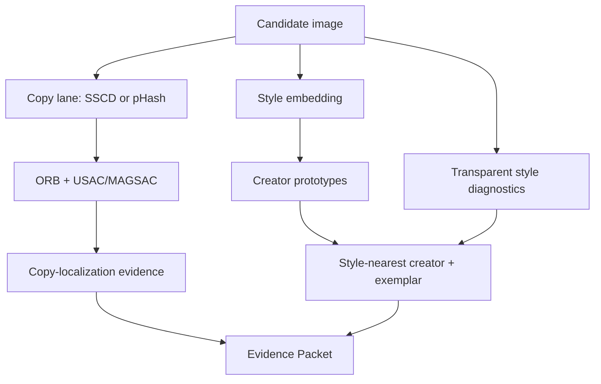

# CreatorProof v0.4 — creator-style similarity lane

## The architectural correction

CreatorProof has two different visual questions and must not force them through one model:

1. **Copy / derivative retrieval:** did pixels or local visual structure from a registered work
   survive crop, resize, recompression, perspective, partial reuse, or related transformations?
2. **Creator-style retrieval:** does a visually different work resemble the recurring style of a
   registered creator even when subject matter and layout are different?

SSCD + ORB/homography is appropriate for the first question. It is intentionally not the gate for
the second. A new landscape can resemble a portrait artist's style while having zero geometrically
corresponding features; that is a valid style-lane outcome rather than a failed copy detector.

## Runtime design



The lanes meet only in the Evidence Packet/UI. Style retrieval does not create homographies, copy
regions, or copy decisions. Copy retrieval does not decide creator style.

## Creator prototypes

Registration now exposes `claimant` as **Creator / style profile** in the UI. Works with the same
normalized creator name form one profile. The profile vector is the L2-normalized mean of its work
embeddings; the candidate is ranked against profile prototypes, then the nearest individual work in
the winning profile becomes the visual exemplar.

Profile strength is explicit:

- `SINGLE_WORK_WEAK`: one work; useful only as an exploratory exemplar.
- `LIMITED_PROFILE`: two works.
- `MULTI_WORK_PROFILE`: three or more works; the minimum recommended demo state.

Three works is not a statistical guarantee. A real customer corpus should include enough varied,
representative work to cover the creator's own stylistic range.

## Learned provider and fallback

### Experimental CSD provider

CreatorProof can load an external checkout of
[Contrastive Style Descriptors (CSD)](https://github.com/learn2phoenix/CSD). The 2024 paper was
designed around style similarity rather than ordinary semantic similarity and specifically motivates
artist/style attribution. CreatorProof uses its normalized style head as a creator-profile embedding.

This integration is deliberately marked experimental. As of the 9 August 2026 research snapshot,
the CSD repository itself warns that the uploaded weights are being investigated because of a
discrepancy with reported paper numbers. Never hide that fact in a hackathon accuracy claim.

### Transparent diagnostic fallback

If CSD is absent or fails, CreatorProof still emits a deterministic diagnostic vector using:

- coarse HSV color distribution (`palette`);
- luminance distribution (`tone`);
- Sobel gradient-orientation energy (`stroke_orientation` proxy);
- local binary-pattern distribution (`texture`).

The fallback is deliberately labelled `diagnostic-style-signature-v1`, `learned=false`. It is useful
for explaining the UI and developing the product without a multi-gigabyte model, but it must not be
described as AI artist attribution or production style accuracy.

## Cross-content style map

The old geometry-aligned overlay/difference UI was removed. It is useful for registered copies but
misleading for two different compositions.

The replacement divides each image into a 4x4 grid. For each candidate tile it searches all tiles in
the exemplar and selects the closest transparent style signature; the reference direction is also
computed. Each selected tile exposes palette/tone/stroke/texture factor values.

This is a **cross-content diagnostic**, not a correspondence map. Tile 1:1 can legitimately match
tile 4:3. No line is drawn and no claim is made that the pictured objects or pixels correspond.

## Why there is no universal style threshold

The v0.4 API returns raw creator-profile similarity, rank, top-vs-runner-up margin, provider identity,
profile sample count, and `UNCALIBRATED_RETRIEVAL_ONLY`.

This follows current evidence. The May 2026 paper
[When Style Similarity Scores Fail](https://arxiv.org/abs/2605.09030) reports that raw CSD cosine can
fail as an absolute same/different score for some artists and proposes a corpus discrimination-gap
diagnostic; CSLS improves the tested readout. This is a strong reason to calibrate CreatorProof on the
actual customer/artist corpus instead of inventing a universal `0.75 = style copied` rule.

Run:

```bash
cd apps/api
uv run --no-sync python -m scripts.benchmark_style_retrieval path/to/manifest.json --require-learned
```

The manifest format is:

```json
{
  "references": [
    {"path": "refs/a1.png", "creator": "Creator A"},
    {"path": "refs/a2.png", "creator": "Creator A"},
    {"path": "refs/b1.png", "creator": "Creator B"}
  ],
  "queries": [
    {"path": "queries/a_new.png", "expected_creator": "Creator A"}
  ]
}
```

The benchmark reports creator Top-1, Recall@K, rank margin, and per-creator discrimination gaps.
Use artist-disjoint/creator-disjoint evaluation where appropriate, hard negatives from visually
similar creators/movements, and different-subject positives. Do not use transformed copies as the
main style benchmark; that would measure the copy lane again.

## Installing the optional CSD runtime

The default build works without CSD. To experiment with the learned lane:

```bash
cd apps/api
uv pip install -r requirements-style-experimental.txt
uv run --no-sync python -m scripts.fetch_csd_runtime
uv run --no-sync python -m scripts.check_style_ai --require-learned
```

The fetch script records the CSD Git commit and checkpoint SHA-256 so results can be reproduced. CSD's
published environment targeted an older Python/PyTorch stack; if the adapter fails on the current API
runtime, use a dedicated model service/container rather than weakening the evidence contract.

## What “effective” means

A production-promotion report should include at minimum:

- creator Top-1 and Recall@5 on genuinely new subjects/compositions;
- hard-negative confusion between visually related creators/movements;
- per-creator discrimination gap and the count of negative gaps;
- score/margin distributions, not just an average;
- creator/profile sample-count sensitivity;
- latency and memory on the actual inference device;
- a blinded human review subset for failure analysis;
- separate transformed-copy metrics for the copy lane;
- no conversion of style score into a legal probability.

Only after those results should a customer-specific `review` threshold be considered. Style evidence
should default to human review, not automatic legal blocking.
