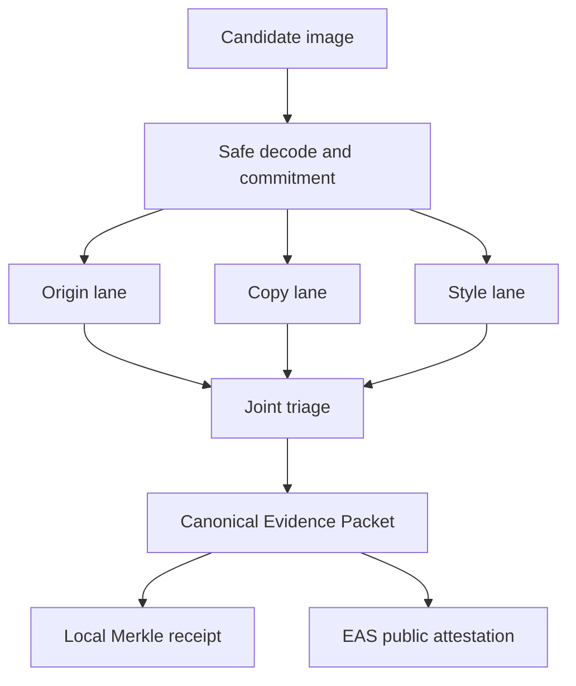

# CreatorProof v0.7 — research-backed architecture

Build signature: **TRI-LANE-PROVENANCE-2026.08.09**

This document defines the highest-confidence architecture that is feasible for a one-week
ideathon prototype. It deliberately rejects one impossible premise: there is no universal model
that can perfectly identify every AI-generated image, every copied work, or every imitation of an
artist's style. CreatorProof is stronger when it makes three narrower measurements, records where
each measurement applies, and abstains outside its tested operating domain.

## The product claim

CreatorProof is a B2B pre-publication evidence and policy API for creative platforms, agencies,
marketplaces, publishers, and brand teams. A customer submits a candidate image and a declared
reference catalog. The API returns three independent lanes:

1. **Origin evidence** — signed Content Credentials plus an ensemble of AI-origin detectors.
2. **Same-work copy evidence** — exact/perceptual fingerprints, learned retrieval, robust local
   geometry, and alignment-conditioned structure.
3. **Creator-style resemblance** — a multi-work creator profile, content controls, corroborating
   visual mechanics, and catalog-conditional false-match calibration.

The output is a tamper-evident Evidence Packet and a configurable policy action. It is not an
automated legal judgment, proof of training-data use, or universal copyright clearance.

## Why v0.6 was not ready

The supplied v0.6 report contained useful runtime checks, but its headline metrics were not valid
evidence of accuracy:

| Reported result | Why it was weak | v0.7 correction |
| --- | --- | --- |
| Style AUC 1.0 | 3 held-out queries and 3 creators cannot estimate open-world error | Minimum-support gates; catalog-conditional conformal tail; creator/source-disjoint protocol |
| Copy precision/recall 1.0 | Only 1 positive and 1 negative | Tiny runs are labelled `SMOKE_TEST_ONLY`; Wilson intervals and hard-negative families required |
| Unrelated image got style `HIGH` | The high tier had no false-match calibration | `HIGH`/`VERY_HIGH` now require 3+ works, 3+ profiles, 19+ negatives, tail control, and positive support |
| Different-content work got `MATCH_FOUND` | A fitted homography can be spurious on repeated lines/textures | Geometry plus SSCD cannot match alone; aligned structural agreement is mandatory |
| “Ready for deployment” | Build health was confused with empirical validity | Runtime, demo, calibrated-domain, and production promotion states are separated |

## System topology

The three lanes must never be collapsed into one opaque “infringement percentage.” Their
combination is a policy rule, not a learned legal classifier.

## Lane 1 — AI-origin evidence

### Evidence order

1. **C2PA provenance** is checked first with the official `c2patool`. A valid, trusted manifest
   with a generative-AI assertion is stronger evidence than a pixel classifier. A missing manifest
   is `UNKNOWN`, never “human-made.”
2. **Community Forensics** is the first bundled open integration because its official MIT-licensed
   model was trained from a much broader generator community than small benchmark detectors.
3. **Independent detector adapters** can add CO-SPY, SSP/ESSP, GAPL, PGC, an operator TorchScript
   model, or a commercial audit API. Every adapter must identify its model version and output a
   bounded score.
4. **Transformation probes** re-run each detector on JPEG 95, JPEG 75, resize/restore, and light
   blur views. An unstable model causes abstention instead of a confident label.
5. **Held-out calibration** applies provider- and version-specific Platt scaling only when the
   configured minimum positive/negative support is present. Uncalibrated scores remain explicitly
   non-probabilistic.

### Why an ensemble, not visual “AI tells”

Research repeatedly shows that detectors can learn generator-, compression-, resolution-, or
dataset-specific shortcuts. Hands, text, symmetry, smooth skin, spectral peaks, and residual noise
may be diagnostics, but none is a universal origin rule. v0.7 exposes frequency/residual summaries
only as descriptive evidence and prevents them from deciding the origin class.

### Primary research basis

- [Community Forensics (CVPR 2025)](https://github.com/JeongsooP/Community-Forensics) — broad
  generator community, official MIT implementation and model.
- [A Sanity Check for AI-generated Image Detection (ICLR 2025)](https://openreview.net/forum?id=ODRHZrkOQM)
  — demonstrates failures of off-the-shelf detectors on challenging data and motivates combined
  high-/low-frequency evidence.
- [CO-SPY (CVPR 2025)](https://github.com/Megum1/CO-SPY) — combines semantic and pixel-space
  forensic features; useful as an independent ensemble family.
- [B-Free (CVPR 2025)](https://github.com/grip-unina/B-Free) — semantic matching of real and
  generated training examples plus robustness-focused training. Its license must be reviewed
  before commercial use.
- [SSP/ESSP](https://github.com/bcmi/SSP-AI-Generated-Image-Detection) — patch-based evidence and
  compression/blur robustness are useful ensemble concepts.
- [RRDataset (ICCV 2025)](https://github.com/ChunXiaostudy/RRDataset) and
  [So-Fake](https://github.com/hzlsaber/So-Fake) — evaluation sources for realistic relaundering
  and social-media distribution shift.
- [NTIRE 2026 Robust AI-Generated Image Detection challenge](https://openaccess.thecvf.com/content/CVPR2026W/NTIRE/papers/Gushchin_NTIRE_2026_Challenge_on_Robust_AI-Generated_Image_Detection_in_the_CVPRW_2026_paper.pdf)
  — current robustness benchmark and model-comparison reference.
- [CLIDE (WACV 2026)](https://openaccess.thecvf.com/content/WACV2026/papers/Betser_General_and_Domain-Specific_Zero-shot_Detection_of_Generated_Images_via_Conditional_WACV_2026_paper.pdf)
  — a useful zero-shot/domain-specific research candidate.

## Lane 2 — same-work copy evidence

### Retrieval then verification

The catalog search and the final decision are intentionally separate:

1. SHA-256 identifies byte-identical images.
2. pHash catches coarse perceptual similarity but only nominates candidates.
3. [SSCD](https://github.com/facebookresearch/sscd-copy-detection) retrieves likely source works
   using L2-normalized learned descriptors.
4. Mutual SIFT/ORB matches and USAC/MAGSAC estimate geometry with inlier count, ratio, two-sided
   coverage, transfer error, and homography sanity gates.
5. Only after geometry succeeds, the reference is warped into candidate coordinates and evaluated
   with luminance correlation, gradient correlation, gradient-magnitude similarity, structural
   similarity, and overlap.
6. A non-identical `MATCH_FOUND` requires geometry **and** aligned structure. SSCD, pHash, or a
   homography alone cannot create a match.

This lane is designed for crops, recompression, colour grading, light retouching, layout reuse, and
partial reuse. It is not the right detector for a completely new composition that only resembles a
style.

## Lane 3 — creator-style resemblance

### Multi-work profiles, not one picture

A creator profile is formed from at least three registered works. The learned style lane uses
[CSD](https://github.com/learn2phoenix/CSD) embeddings when the external checkpoint is present,
then applies CSD+-style CSLS density correction for catalog ranking. It corroborates the learned
score with:

- palette and tone diagnostics;
- stroke-orientation and texture mechanics;
- bidirectional tile consistency;
- SSCD content similarity as a confound measurement;
- winner-versus-runner-up catalog margin;
- leave-one-out within-creator cohesion;
- cross-creator negative-tail calibration.

`HIGH` and `VERY_HIGH` are unavailable until the reference cohort can estimate a meaningful
false-match tail. The tier remains `REVIEW` when the profile or calibration cohort is small.

Promising next-stage research includes
[IntroStyle (ICCV 2025)](https://openaccess.thecvf.com/content/ICCV2025/papers/Kumar_IntroStyle_Training-Free_Introspective_Style_Attribution_using_Diffusion_Features_ICCV_2025_paper.pdf),
[DiffSim](https://github.com/showlab/DiffSim), and
[MCID (ICCV 2025)](https://openaccess.thecvf.com/content/ICCV2025/papers/Huang_MCID_Multi-aspect_Copyright_Infringement_Detection_for_Generated_Images_ICCV_2025_paper.pdf).
They are model-tournament candidates, not silently bundled dependencies.

## Joint decision policy

| AI-origin lane | Copy lane | Style lane | Product triage |
| --- | --- | --- | --- |
| Any | Verified match | Any | Copy/rights review; origin reported separately |
| Supported | No copy | Calibrated high style | AI + style resemblance review — the ideathon “aha” case |
| Inconclusive | No copy | High style | Style resemblance, origin unresolved; human review if customer policy requires |
| Supported | No copy | Low style | AI-origin review only; no rights match |
| Low/unavailable | No copy | Low | Source-scoped pass, explicitly not copyright clearance |

The policy never says that AI generation is infringement or that style resemblance proves copying.

## Evidence and proof architecture

Every completed scan produces canonical JSON containing input commitments, catalog scope,
model/version state, raw measurements, abstentions, decision reasons, and limitations. The proof
object is excluded from the committed payload to avoid circular hashing.

Two proof modes are implemented:

- **Local Merkle transparency log** — RFC 6962-style domain-separated leaves/nodes and a verifiable
  inclusion path. It is fast and demo-safe but is prominently labelled **not blockchain**.
- **Ethereum Attestation Service** — a real on-chain attestation using an EAS schema exactly equal
  to `bytes32 packetHash`. Only the packet commitment goes on-chain; no artwork, claimant data,
  private score, or API payload is published. A mined transaction, attestation UID, chain ID, and
  validity check are returned.

Primary sources:

- [C2PA specification 2.4](https://spec.c2pa.org/specifications/specifications/2.4/specs/C2PA_Specification.html)
- [Official c2pa-rs/c2patool](https://github.com/contentauth/c2pa-rs)
- [Ethereum Attestation Service](https://attest.org/)
- [EAS contracts](https://github.com/ethereum-attestation-service/eas-contracts)
- [EAS SDK](https://github.com/ethereum-attestation-service/eas-sdk)

## Production data plane

The prototype uses exhaustive catalog comparisons and local storage. The production path is:

| Prototype component | Production replacement |
| --- | --- |
| SQLite | PostgreSQL with tenant-scoped row-level controls |
| Local files | S3-compatible encrypted object storage with lifecycle deletion |
| Exhaustive vectors | Qdrant, pgvector, or FAISS service with exact re-ranking |
| Inline jobs | Redis/Celery or managed queue with GPU workers |
| Development key | Hashed scoped API keys, rotation, quotas, audit logs |
| One threshold set | Tenant/domain/model-version calibration registry |
| Local Merkle log | Signed transparency checkpoints plus optional EAS batch roots |

Batching one Merkle root into EAS is the cost-efficient production design: thousands of private
Evidence Packets receive inclusion proofs while only a periodic root is publicly attested.

## One-week ideathon scope

### Must be live

- Register multiple works and creator profiles.
- Scan an unregistered candidate.
- Show the nearest reference side-by-side.
- Demonstrate a retouched near-copy that verifies.
- Demonstrate a hard negative that draws no fake regions.
- Demonstrate a different-content AI image with calibrated creator-style resemblance.
- Show transformation-stability evidence for AI-origin detection.
- Open a verifiable local Merkle receipt, then optionally show a testnet EAS receipt.
- Export the Evidence Packet.

### Must not be claimed

- perfect AI-generated-image detection;
- proof that a model trained on a particular work;
- universal artist attribution from one image;
- legal infringement probability;
- production accuracy from smoke-test data;
- “blockchain active” when only a local Merkle receipt exists.

## Business model

The defensible offer is **risk triage as infrastructure**, not a court substitute.

- **API plan** — per 1,000 scans with separate standard and GPU forensic tiers.
- **Catalog plan** — monthly fee by protected reference count and creator profiles.
- **Enterprise plan** — private deployment, customer-domain calibration, audit retention, SSO,
  policy rules, and SLA.
- **Marketplace workflow** — pre-upload scan plus rights/licensing routing.
- **Agency workflow** — pre-publication proof packet for campaigns and client approvals.

The moat is the customer's labeled reference catalog, calibrated operating points, auditable
multi-lane evidence, and feedback loop—not a single public model checkpoint.

## Hackathon demonstration sequence

1. Upload a registered work and an AI-retouched variant. Reveal verified copy geometry and aligned
   structure despite colour changes.
2. Upload an unrelated image. Show the nearest candidate but zero fabricated annotations.
3. Upload a new-composition AI imitation. Copy lane stays negative; AI-origin and calibrated
   creator-style lanes light up independently, producing the combined review banner.
4. Open the Evidence Packet and verify its Merkle inclusion proof.
5. If network credentials are available, show an actual EAS testnet transaction containing only the
   packet hash.

That sequence creates a genuine “aha”: CreatorProof distinguishes *AI origin*, *same-work reuse*,
and *cross-content style resemblance* instead of pretending they are one problem.
