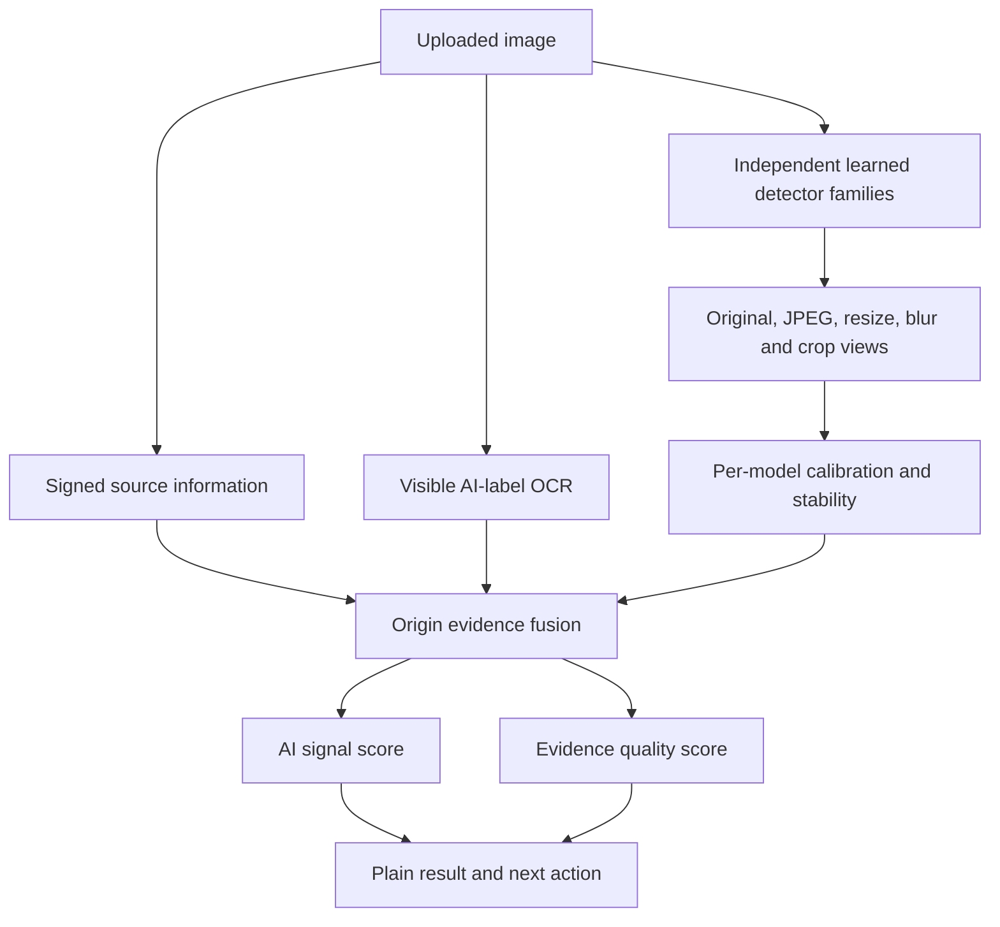

# CreatorProof v0.9 — independent origin evidence, plain scoring, and product UI

Build signature: `PLAIN-SCORE-WATERMARK-2026.08.09`

## 1. What v0.9 fixes

The v0.8 origin pipeline already ran independently from catalog retrieval, but two product-level
failures could still mislead a reviewer:

1. a missing catalog match could dominate the case wording even when origin evidence required
   review; and
2. removing all visible scoring made it hard to understand why the product reached its conclusion.

v0.9 fixes both without pretending that open-world AI-image detection is solved. It also adds an
independent visible-label check because an image can contain an explicit `AI generated` notice even
when learned detectors are quiet. A visible label is useful review evidence, but it is not trusted
provenance: labels can be copied, removed, misread, or forged.

## 2. Product questions stay separate

CreatorProof answers three different questions:

| Lane | Question | What a positive result means | What it does not mean |
| --- | --- | --- | --- |
| AI check | Was AI likely involved? | One or more origin signals require attention | It does not prove infringement or identify a copied work |
| Work match | Does this reuse a stored work? | Retrieval plus strict pairwise checks support reuse of a particular reference | It is not an origin detector or legal ruling |
| Creator profile | Does different content resemble a creator's registered body of work? | The candidate is unusual relative to a multi-work creator profile | It does not prove model training, copying, or ownership |

Catalog retrieval never gates the AI check. `NO_MATCH_IN_CHECKED_SOURCES` means only that the
declared catalog did not produce a verified same-work match.

## 3. v0.9 origin architecture

The work-match and creator-profile lanes run separately and are combined only in a final product
triage summary. They never overwrite the origin result.

## 4. Visible AI-label evidence

`VisibleAIMarkerProvider` uses local Tesseract OCR over the full image and four overlapping corner
views. Each view is contrast-normalized and safely upscaled. Sparse-text and block-text page
segmentation modes are both evaluated because watermark layouts vary. The recognizer tolerates the
common OCR error where the capital `I` in `AI` is read as `l` or `1`.

Built-in phrases include explicit forms such as:

- `AI generated`;
- `generated by AI`;
- `generated with AI`;
- `made with AI`;
- `created using AI`;
- `synthetic image`.

Operators can add reviewed phrases through
`CREATORPROOF_VISIBLE_AI_MARKER_TERMS_JSON`. This is deliberately configurable rather than silently
classifying every generator brand name as proof of AI use.

The output includes the recognized phrase, OCR confidence, source view, and a normalized image box.
The UI highlights the box. No label found is neutral. OCR unavailable or failed is also neutral.

For a production tournament, evaluate Apache-2.0 PaddleOCR as a complementary OCR family on a locked
watermark set containing small, transparent, rotated, multilingual, and logo-plus-text marks. Do not
count two OCR engines as two independent AI-origin model families; both are visible-text evidence.

## 5. Restored scoring contract

The default UI shows two numbers. Neither is an AI probability.

### 5.1 AI signal, 0–100

Let:

- `M = 100p` for the quality-weighted learned-family fusion `p`, when available;
- `W = 100w` for visible-label marker strength, when a label is found;
- `P = 100` for trusted signed AI provenance or `82` for a valid but untrusted AI assertion;
- `k` be the number of positive source types among learned models, visible label, and provenance.

The displayed signal is:

\[
S = \min(100, \max(M, W, P) + 5\,\mathbf{1}[k \ge 2]).
\]

Missing inputs do not contribute zero evidence against AI; they are omitted. Marker strength is a
presentation heuristic for the detected label, not the probability that the pixels were generated.

### 5.2 Evidence quality, 0–100

For learned models:

\[
Q_m = 100(0.35C + 0.35K + 0.30T),
\]

where `C` is independent-family coverage, `K` is the calibrated-family fraction, and `T` is
transformation stability. Visible-label quality is capped at 55 because the label is forgeable.
Trusted signed provenance has quality 100; a valid but untrusted assertion has quality 55.

\[
Q = \min(100, \max(Q_m,Q_w,Q_p) + 6\,\mathbf{1}[k \ge 2]).
\]

The signal answers “how much did available checks react?” The quality score answers “how dependable
were those checks here?” A strong signal with low quality remains review, not certainty.

### 5.3 Why no single infringement percentage exists

Origin, copy, style, provenance, rights records, and company policy are different variables. Adding
them into one percentage would imply a calibrated legal probability that the system does not have.
The product therefore shows a plain action plus lane-specific scores and evidence.

## 6. Origin decision contract

| Evidence state | Plain result | Product action |
| --- | --- | --- |
| Trusted signed AI-use assertion | Signed provenance identifies AI use | Review origin, copy, and style lanes |
| Two stable independent strong model families | Multiple checks found AI-generation indicators | Review |
| Visible label plus calibrated positive model family | AI indicators found by more than one check | Review |
| Visible explicit AI label only | A visible AI label was found | Review; do not treat as provenance |
| One positive family or incomplete calibration | AI indicators need review | Review |
| Low resolution, instability, or model disagreement | Origin cannot be determined | Review / abstain |
| No active learned model and no label | AI checks are not active | Activate checks and rescan |
| Two independent, calibrated, stable quiet families | No strong AI indicators found | Continue policy workflow; never claim human origin |

Any positive, inconclusive, or unavailable origin state changes a source-scoped catalog
`PASS_BY_POLICY` to product `REVIEW` when there is no verified work match. The reason code explicitly
says this is not an infringement finding.

## 7. UI and UX contract

The normal reviewer sees, in order:

1. one bottom-line sentence;
2. the next action;
3. three large question cards;
4. AI signal and evidence quality side by side;
5. three plain-language reasons: model checks, visible label, and signed source information;
6. the candidate image with any recognized label highlighted.

The primary navigation contains only four views: summary, AI use, stored-work reuse, and creator
profile. Detailed structure and style maps remain available inside their parent lane. Provider names,
raw values, reason codes, robustness traces, and calibration state are collapsed under **advanced
details for judges and engineers**. Body text, controls, and result cards use larger responsive type.

## 8. Research-backed upgrade path

The next accuracy gains must come from a measured model tournament, not from lowering thresholds for
one screenshot.

| Candidate | What to evaluate | Integration status |
| --- | --- | --- |
| Generator-Aware Prototype Learning (GAPL), CVPR 2026 | Open-generator coverage and generator-specific prototypes | Research candidate; reproduce in isolated adapter |
| Image-Adaptive Prompt Learning, CVPR 2026 | Generalization to unseen generators | Research candidate |
| Arbitrary-data-source training, CVPR 2026 | Whether wider authorized data improves coverage without harming transfer | Research candidate |
| NTIRE 2026 robust-detection systems | Compression, resizing, screenshot, and unseen-generator behavior | Use challenge protocol to design the tournament |
| Difference-in-Difference, CVPR 2026 | Reconstruction residuals as a complementary evidence family | Research candidate; benchmark runtime and error diversity |
| QuAD, CVPRW 2026 | Quality-aware aggregation over lawful near-duplicate versions | Research inspiration only unless its license permits the intended deployment |
| PaddleOCR | Better small/rotated/multilingual visible-label recovery | Optional Apache-2.0 OCR tournament candidate |
| C2PA 2.2 / official `c2patool` | Signed provenance before forensic inference | Existing provider boundary; activate on target machine |
| SynthID or Stable Signature | Vendor/model-specific watermark verification | Use only with an authorized matching decoder; absence is never negative evidence |

An added detector earns production weight only if it improves locked, generator-disjoint selective
risk and worst-group behavior while adding genuinely different errors. Multiple checkpoints from one
family do not count as independent corroboration.

## 9. Validation dataset requirements

Split by source lineage and generator so near-duplicates cannot leak across calibration and test.
Include:

- unseen current generators and versions;
- AI art, photorealistic images, illustrations, graphic design, and text-heavy images;
- human digital art and heavily processed human images as hard negatives;
- AI-retouched human work and human-retouched AI work;
- screenshots, crops, JPEG/WebP, resize, blur, sharpen, color shifts, and overlays;
- visible labels that are genuine, forged, partially erased, translucent, rotated, and multilingual;
- images with generator names used as ordinary editorial text;
- images with no catalog match and images with a true stored-work match.

Report ROC-AUC and average precision, but prioritize FPR at 95% TPR, TPR at 1% FPR, abstention,
selective accuracy, worst-generator recall, worst-human-source false-positive rate, calibration error,
and confidence intervals. A chosen demo image and a toy three-case benchmark are not accuracy claims.

## 10. Honest boundary

AI-image detection is open-world and adversarial. Metadata can be stripped, watermarks can be
removed, model artifacts can be washed out by editing, and unseen generators shift the input
distribution. CreatorProof v0.9 is designed to avoid unsupported negative certainty and to combine
several review signals. It cannot guarantee universal AI detection or determine copyright
infringement.

## 11. Primary sources and repositories

- Generator-Aware Prototype Learning, CVPR 2026:
  <https://openaccess.thecvf.com/content/CVPR2026/papers/Qin_Scaling_Up_AI-Generated_Image_Detection_with_Generator-Aware_Prototypes_CVPR_2026_paper.pdf>
- Image-Adaptive Prompt Learning, CVPR 2026:
  <https://openaccess.thecvf.com/content/CVPR2026/papers/Li_Towards_Generalizable_AI-Generated_Image_Detection_via_Image-Adaptive_Prompt_Learning_CVPR_2026_paper.pdf>
- Leveraging Arbitrary Data Sources, CVPR 2026:
  <https://openaccess.thecvf.com/content/CVPR2026F/papers/He_Leveraging_Arbitrary_Data_Sources_for_AI-Generated_Image_Detection_Without_Sacrificing_CVPRF_2026_paper.pdf>
- NTIRE 2026 robust AI-generated image detection challenge:
  <https://openaccess.thecvf.com/content/CVPR2026W/NTIRE/papers/Gushchin_NTIRE_2026_Challenge_on_Robust_AI-Generated_Image_Detection_in_the_CVPRW_2026_paper.pdf>
- Difference-in-Difference, CVPR 2026:
  <https://openaccess.thecvf.com/content/CVPR2026/html/Qi_A_Difference-in-Difference_Approach_to_Detecting_AI-Generated_Images_CVPR_2026_paper.html>
- Difference-in-Difference repository: <https://github.com/Qixinyi1122-lucky/DID>
- QuAD quality-aware calibration: <https://github.com/grip-unina/QuAD>
- Community Forensics: <https://github.com/JeongsooP/Community-Forensics>
- GRIP CLIP-based synthetic-image detection:
  <https://github.com/grip-unina/ClipBased-SyntheticImageDetection>
- PaddleOCR: <https://github.com/PaddlePaddle/PaddleOCR>
- Tesseract OCR: <https://github.com/tesseract-ocr/tesseract>
- C2PA 2.2 specification:
  <https://spec.c2pa.org/specifications/specifications/2.2/specs/C2PA_Specification.html>
- Google DeepMind SynthID: <https://deepmind.google/models/synthid/>
- Stable Signature: <https://github.com/facebookresearch/stable_signature>

Inspect the exact license, model-card restrictions, checkpoint terms, and dataset rights before
shipping any candidate. QuAD and Stable Signature are retained as valuable research references even
where their current terms may prevent direct commercial reuse. Research insight is not permission to
copy restricted code or weights into a paid product.
